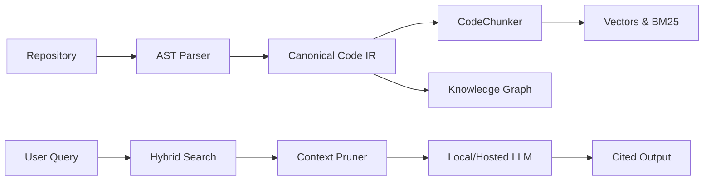

# AI Code Understanding Engine

CodeLens AI is a local-first, developer-facing reasoning engine providing semantically-aware structural analysis of large codebases.

**Status:** Phase 9G — Research Complete

---

## What It Does
Given a natural-language question, the engine locates the relevant code, traverses its exact execution flow topologically, explains dependencies, and reasons about downstream impacts, without requiring manual recursive file searches.

## Why It Is Different
Traditional vector-RAG architectures retrieve chunks based on semantic similarity, which limits structural awareness. Related functionality often lives in varying scopes. CodeLens addresses this by replacing semantic indexing gaps with Canonical Code IR representations layered with Hybrid Retrieval metrics. **The LLM is the final reasoning layer over a structured code intelligence system.**

## Architecture


## Core Capabilities
*   **Search**: Find exact implementations and abstractions.
*   **Symbol Exploration**: Traverse topological relationships spanning entire codebases.
*   **Impact Analysis**: Compute caller/callee blast-radii mapping.
*   **AI Chat**: Contextual queries scoped locally inside graphs.
*   **Citations**: Context source verification.

## Supported Languages
*   **Python**: `tree-sitter-python`
*   **Java**: `tree-sitter-java`
*   **TypeScript / JavaScript**: `tree-sitter-typescript`

## Retrieval Pipeline
An ablated hybrid retrieval system running `pg_bm25` lexicals, `pgvector` semantics, and BFS reverse-dependency structural traversals, fused via Reciprocal Rank Fusion configurations targeting identifiers.

## Incremental Indexing
Automatically synchronizes codebase commits by executing bounded `git diff` operations detecting opaque refactors while replacing minimal `Canonical Code IR` nodes without full re-indexing loads.

## LLM Context Engine
Executes framework-agnostic connections directly mapping OpenAI, Anthropic, or Local Ollama servers. Replaces unbounded chat-histories with stateless, procedurally pruned, context-packed XML boundaries.

## Product UI
A React + Vite Single Page Application directly driving dashboard diagnostics, global searches, deep visual D3 structural graphs, and LLM conversations.

## Research Evaluation
Evaluated over an explicitly mapped 95-relevance static dataset. Validates that structural integration mitigates semantic loss inherently plaguing traditional vector RAG implementations in highly disjoint structural environments.

## Benchmark Results
**System C (BM25 + Vector + Graph):** 
*   **MRR**: `0.7560` (+0.2379 over Vector baselines)
*   **Recall@5**: `0.8403`
*   **HitRate@5**: `0.9375`
*   **NDCG@5**: `0.7093`

## Security
*   **Path Traversal**: Local repository paths are developer-trusted inputs and are not OS-sandboxed. Arbitrary relative resolutions are mathematically evaluated and accepted if the directory exists.
*   **Prompt Injection**: Hardened through explicit trusted-instruction and untrusted-evidence separation utilizing `<code_evidence>` XML boundaries. (Note: Security is architectural; absolute resistance requires adversarial evaluation).

## Tech Stack
**Frontend**: React, TypeScript, Vite, TailwindCSS
**Backend**: Python, FastAPI, SQLAlchemy, Tree-Sitter
**Database**: PostgreSQL, pgvector, pg_bm25

## Quick Start
*Full end-to-end Docker Compose setup instructions dropping soon...*

## Project Structure
```
.ai/              Project memory 
backend/          FastAPI application
frontend/         React application
code-analyzer/    AST parsing and Canonical IR
retrieval/        BM25 / vector / graph retrieval
graph/            Symbol graph builder
llm/              Provider-agnostic LLM/embedding interface
evaluation/       Benchmarks and quality metrics
docs/             Architecture and API documentation
```

## Testing
Tested across `pytest` orchestrations mapping securely against 742 localized structural assertions.

## Research Report
The project report evaluates structural relationships. See [Phase 9 Research Report](docs/research/phase-9-research-report.md).

## Limitations
*   Tested robustly exactly against subsets of 48 queries across 3 projects, limiting assumptions of global million-line corpus accuracy.
*   Token bounding metrics not rigorously tested against real enterprise hallucinations.
*   Local trust developer model requires active host awareness. 

## Roadmap
* Phase 10: Optimizations and Scaling 
