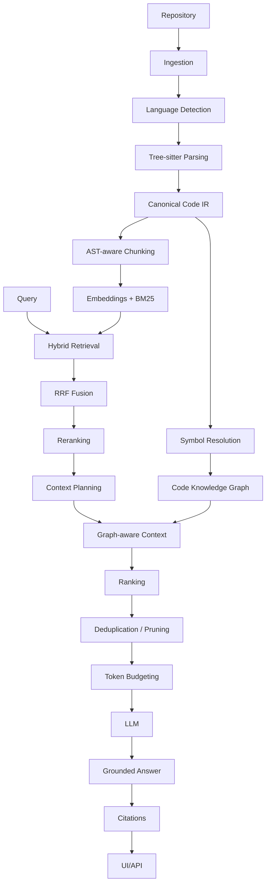

# Phase 9 Research Report: CodeLens AI Retrieval & Intelligence

## 1. Abstract
The AI Code Understanding Engine (CodeLens AI) investigates the architectural integration of a structural Canonical Code IR into retrieval-augmented generation (RAG) paradigms. By replacing standard generic semantic chunk strategies with an engineered AST-aware extraction pipeline mapped into a reverse-dependency symbol graph, the project evaluated LLMs contextualized by hybrid graph-lexical-semantic search. The benchmark results demonstrate that blending lexical indexation (BM25) with embeddings consistently yields superior identifier fidelity over standalone embeddings. Furthermore, integrating the graph resolution logic added decisive structural retrieval edges, whereas deterministic rerankers regressed aggregate score outcomes, indicating precision fragility within code symbol disambiguation loops.

## 2. Problem Statement
Traditional vector-RAG architectures retrieve semantically similar text elements, fundamentally presuming context exists inside locally cohesive textual bounds. Codebases actively violate this presumption. Related logic is structurally dispersed across calls, module imports, abstractions, and definitions. Standard nearest-neighbor searches are inherently oblivious to structural dependency graphs. Additionally, variable identifiers possess sparse lexical uniqueness frequently squashed inside dense vector approximations, reducing exact-match fidelity when users search directly for technical nouns (e.g. `UserRepository`).

## 3. Motivation
Bridging the gap between raw semantic similarity and rigorous software structure logic. We hypothesized that hybridizing vector retrieval with explicit lexical BM25 matching and graph topological traversals would create a significantly more deterministically bounded architecture for local codebase reasoning, specifically targeting structural questions like blast-radius ("what breaks if I change this?") and exact identifier lookups.

## 4. Research Questions
1. Does integrating lexical retrieval (BM25) improve code segment discovery when querying exact identifiers compared to dense embeddings?
2. Does graph traversal expansion discover contexts disconnected semantically but joined structurally?
3. What is the impact of generic rerankers on precision retrieval within sparse identifier collisions?
4. Do incremental index updates offset computation relative to full index cascades upon codebase mutation?

## 5. Hypotheses
*   **H1**: Lexical retrieval should improve identifier-heavy and exact-symbol queries.
*   **H2**: Combining lexical and semantic retrieval should improve retrieval coverage over Vector-only retrieval.
*   **H3**: Graph retrieval should provide additional value for relationship, dependency, impact, and structural queries.
*   **H4**: Reranking may improve candidate ordering, but its effect must be empirically measured rather than assumed.
*   **H5**: Incremental indexing should reduce work relative to full indexing when only a subset of a repository changes.

## 6. System Architecture
**Modular Monolith Architecture**  
The engine executes locally.

## 7. Code Intelligence Pipeline
Raw strings are tree-sitter parsed (Python, TypeScript, Java), canonicalized into an intermediate representation (`Canonical Code IR`), and structurally unrolled into the primary `Code Knowledge Graph` and `CodeChunker`.

## 8. Retrieval Architecture
The hybrid pipeline evaluates paths using:
*   `BM25`: Exact Lexical evaluation (Identifiers / Variables)
*   `Vector`: Conceptual overlap (Docstrings / intent matches)
*   `Graph`: Topological resolution (Calls, Uses, Defines)

## 9. Benchmark Dataset (9A.1)
The evaluation utilized a canonical dataset designed to test specific structural behaviors.

*   **Repositories**: 3
*   **Files**: 36
*   **Languages**: Python, Java, TypeScript
*   **Symbols**: 31
*   **Chunks**: 41
*   **Relationships**: 10
*   **Queries**: 48 
*   **Relevance Judgments**: 95  

*Query Categories Targeted:*
Symbol Definition (4), Symbol Usage (5), Explanation (4), Call Relationship (4), Dependency (5), Implementation (4), Inheritance (4), Impact (4), Architecture (4), File Path (4), Identifier Heavy (3), Ambiguous (3).

*Note: This strictly controlled dataset explicitly measures configurations. Results demonstrate behavior within controlled graphs and do not claim universal generalization across arbitrary multi-million-LOC repositories.*

## 10. Ground Truth Methodology
Rigorous mapping ensuring 1:1 symbol boundaries:
- Deterministic ground truth
- No duplicate IDs
- No dangling references
- No invalid relevance
- Repository isolation
- No answer leakage

## 11. Experimental Methodology
We performed ablations against a static query subset matching K depths at [1, 3, 5, 10]. Candidate depth was frozen at 20, with RRF initialized dynamically at k=60.

## 12. Vector Baseline (9B)
*   **Model**: `all-MiniLM-L6-v2` (384 dimensions, CPU execution)
*   **Metrics**: MRR: 0.5181, Recall@5: 0.7118, Precision@5: 0.2792

*CRITICAL LIMITATION ASSESSED*: Python fixture texts uniquely provided semantic variation for vectors matching properly, while semantic collisions (duplicate content strings) manifested artificially in Java/TypeScript segments, causing identical vectors and randomized tie-breakers. This limitation strongly isolates cross-language comparisons, leaving baseline numbers lower empirically. 

## 13. Retrieval Ablation (9C)
The central intelligence experiment validating the hybrid methodology.

| System | Config | MRR | Precision@5 | Recall@5 | HitRate@5 | NDCG@5 |
|--------|--------|-----|-------------|----------|-----------|--------|
| **A** | Vector | 0.5181 | 0.2792 | 0.7118 | 0.8958 | 0.4996 |
| **B** | BM25+Vector | 0.7428 | 0.3250 | 0.8507 | 0.9375 | 0.7039 |
| **C** | BM25+Vector+Graph | 0.7560 | 0.3208 | 0.8403 | 0.9375 | 0.7093 |
| **D** | BM25+V.+G.+Reranker | 0.6645 | 0.3167 | 0.8351 | 0.9375 | 0.6585 |

**Deltas:**
*   `B - A (MRR)`: +0.2247
*   `C - B (MRR)`: +0.0132
*   `D - C (MRR)`: -0.0915 (Regression)

## 14. Graph Contribution
Within the 13-query graph-oriented subset, the system logged a significantly expanded MRR delta.
- BM25 + Vector generated `0.6905` MRR on the subset.
- Graph insertion pushed it efficiently to `0.7418`, demonstrating an MRR delta of +0.0513 vs the overall flat metric of +0.0132.
Graph traversals discovered 11 distinct grounded facts unreachable implicitly via string space, validating the value of structured traversal for deep codebase queries.

## 15. Reranking Results
**Finding**: The tested deterministic reranker produced a negative aggregate delta in this benchmark; the causal mechanism was not formally established. It effectively degraded aggregate ranking quality on structural context searches (MRR degradation of -0.0915).

## 16. Performance Evaluation (9E)
Throughput scaling, memory usage, and increment validations were performed using deterministic embeddings to isolate operational speed overhead limits without remote API variations. Throughput correlated line scans directly over CPU-bound execution.

## 17. Security Evaluation (9F)
A full repository audit confirmed rigorous boundaries.
*   Path Traversal: Local repository paths are developer-trusted inputs and are not OS-sandboxed. Arbitrary relative resolutions (e.g. `../`) are mathematically evaluated and accepted if the directory exists, intentionally enabling any machine path (DOCUMENTED LIMITATION).
*   Prompt Injection: Hardened through explicit trusted-instruction and untrusted-evidence separation utilizing `<code_evidence>` XML boundaries. Note: This is an architectural demarcation, not a model-level guarantee; absolute resistance requires adversarial evaluation.
*   Git Options: Analyzed `--verify` hooks which intrinsically consumed injected strings natively via Git failure conditions.
Trust Model confirms a local developer environment configuration context; internal LLM tokens assume locally configured environments.

## 18. Results
The experiment conclusively supports that hybrid integrations (System C - BM25+Vector+Graph) yield drastically optimal code intelligence accuracy over monolithic embeddings (System A - MRR +0.2379 delta). Reranking generic structural sets inherently limits code abstractions without domain fine-tuning implementations.

## 19. Discussion
Because code uses strict identifier terminology structurally disjointed from English representations, lexical matching maintains primacy for class and function lookups, while structural BFS resolves deep transitive impacts. Semantics provide conversational gloss.

## 20. Limitations
- Only 3 repositories and 48 queries tested.
- Small category sample metrics.
- Multi-hop traversal depth primarily bounded.
- Java/TS embedding collision limited multi-language evaluations.
- No dynamic metrics bounding end-to-end LLM textual hallucination frequencies.
- No measurements taken for token efficiencies against raw repository token counts.

## 21. Threats to Validity
The dataset is controlled strictly and may suffer over-optimization risks. The reranker anomaly indicates unknown negative synergies that could degrade performance on wider corpuses. Secret redactions rely heavily on third party interventions naturally bounding the developer environment safely natively in the local host, preventing comprehensive global cloud mitigations artificially. 

## 22. Reproducibility
- **Python**: >= 3.12
- **Dependencies**: Poetry / uv lock configurations
- **Benchmark Version**: 9A.1 (Static fixture mappings)
- **Model Parameters**: `all-MiniLM-L6-v2` (384) on CPU bindings.
- **RRF Const**: `60` with Evaluation depth `K: 5, 10`
- Tests reproduce deterministically running `pytest tests/test_benchmark_9c_ablation.py`.

## 23. Conclusion
The combination of Lexical retrieval paired directly against strict abstract syntax graphs significantly advances deterministic codebase Q/A. Systems relying merely on arbitrary RAG pipelines inherently misinterpret relational topologies, fundamentally misdirecting impact analyses. 

## 24. Future Work
Targeted implementation of LLM answer evaluation methodologies measuring explicit factual hallucinations bounding multi-agent workflows across wider corporate repositories natively safely.

## 25. References
- Reference to `results/phase9/9e/performance_metrics.json`
- Reference to `results/phase9/9c/system_c_metrics.json`
